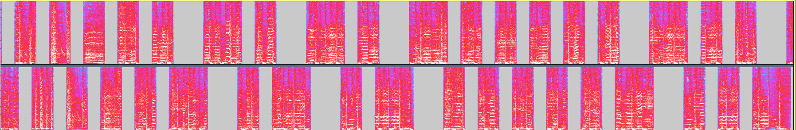

# Weeb Radio

>A rogue attacker has hacked into our otaku radio station! We believe that he is stealing our rare memes and waifu secrets... please find out what he's saying!

>made by rm -k

>Hint: 八月十四日です。マンチェスターからのライブ W P I F M です。

So in this chall, we've been thrown an mp3 filled with weeb music. However, after a bit, the audio alternates between the left channel and right channel. This could indicate some kind of binary...



Just focusing on the lengths of each switch, you can see that there are "long" segments and "short" segments. Now need to convert the segments into one of:
  * Short left
  * Short right
  * Long left
  * Long right

You can either do it manually, write a script to do it, or, in my case, have a teammate who seems to spend an entire day devoted to doing CTFs, and have them do it manually (you're a hero joseph).

The end result should be something like this:
```
SHORT LEFT - 1
SHORT RIGHT - 0
LONG LEFT - A
LONG RIGHT - B

010AB1010AB101010AB10AB101010101010AB10AB10AB1010101010AB1010AB10AB1010AB101010101010ABAB101010AB10AB1010AB10101010101010AB1010AB101010AB10101010101010AB10AB1010101010AB1010AB101010AB10101010101010AB10AB10AB1010AB101010AB10AB10AB1010AB10AB10AB101010101010AB1010ABAB101010AB10AB1010AB101010AB1010AB1010AB10AB101010AB1010AB1010101010AB10101010AB1010AB1010101010101010AB1010AB1010AB10101010101010AB1010101010AB10AB10AB1010AB101010AB1010AB10101010AB101010AB10101010AB1010AB101010101010AB10101010AB101010101010AB10101010AB101010101010AB101010101010AB101010101010AB1
```

Now, this is where the hint comes in handy. From Japanese to English, the hint translates to the following:
`It is August 14th. Live from Manchester WPIFM`

There are a couple of vital pieces of info in this hint. First off looking at "Live from **Manchester**". This is a critical hint that refers to [Manchester Code](https://en.wikipedia.org/wiki/Manchester_code). With this lead, we can convert the A's and B's into 11 and 00 respectively, resulting in:
```
0101100101011001010101100101100101010101010110010110010110010101010101100101011001011001010110010101010101011001100101010110010110010101100101010101010101100101011001010101100101010101010101100101100101010101011001010110010101011001010101010101011001011001011001010110010101011001011001011001010110010110010110010101010101011001010110011001010101100101100101011001010101100101011001010110010110010101011001010110010101010101100101010101100101011001010101010101010110010101100101011001010101010101011001010101010110010110010110010101100101010110010101100101010101100101010110010101010110010101100101010101010110010101010110010101010101011001010101011001010101010101100101010101010110010101010101011001
```
Just throwing it into a Manchester Code decoder resulted in meaningless junk... so clearly there has to be another step (the people over at WPI never seem to make their challenges *that* easy).

Now we need another piece of important information from the hint, **August 14**, or more accurately, **8/14**.

Just googling "8/14" and relating it to signals results in [eight-to-fourteen modulation](https://en.wikipedia.org/wiki/Eight-to-fourteen_modulation). It essentially turns 8 bit data and encodes it into 14 bits, so to decode our mysterious sequence of 1's and 0's, we simply split it into chunks of 14 bits, and then decode.

Splitting it gives us:
```
['00100010000100', '10000000100100', '10000001000100', '10001000000010', '10000100100010', '00000001000100', '00100000000100', '10000001000100', '00100000000100', '10010001000010', '01001000100100', '10000000100010', '10000100100010', '00010001000100', '10000100010000', '00100000100010', '00000000100010', '00100000000100', '00001001001000', '10000100010000', '01000010000010', '00100000001000', '00100000001000', '00100000001000', '00001000000010']
```
And now we simply decode!
thankfully, there is a convenient [conversion table](www.physics.udel.edu/~watson/scen103/efm.html) online that can help us convert data using eight-to-fourteen modulation.

Now comes the final stretch! Simply decode and get that sweet, beautiful flag.

`WPI{aM_I_j@paN3se_y3t???}`
